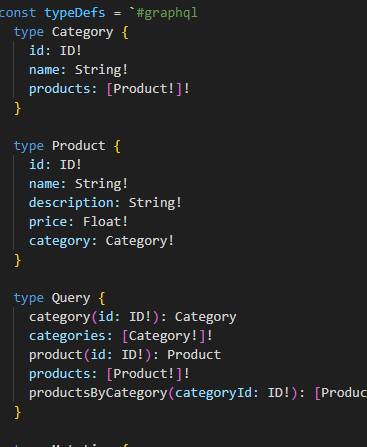
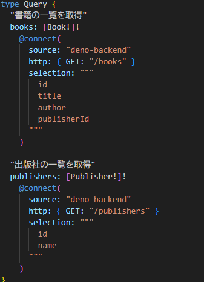

# Apollo Connectorsで始める
# GraphQL導入のススメ

**Web技術集会 2025-xx-xx**
いとじゅん / @itojum1230

---

# 目次

1. GraphQLについて
2. Apollo Connectorsについて
3. Discord APIで試してみよう
4. まとめ

---

# GraphQLについて

---

## GraphQLとは
- ほしいデータを
取得するためのクエリ言語
- 複数リソースを単一リクエストで
まとめて取得できる

---

### メリット
- クライアント側で必要なデータを取捨選択できる
- 複数のエンドポイントを1つのエンドポイントでまとめられる
### デメリット
- 学習コスト
- パフォーマンス

---

# Apollo Connectorsについて

---

## Apollo Connectorsとは
- GraphQLサーバーから
外部のREST APIやデータソースを
直接呼び出す仕組み

---

## 大まかな構成

---

# 本題

## セクション1

- 詳細1
- 詳細2
- 詳細3

---

# まとめ

- 結論1
- 結論2
- 今後の展望 