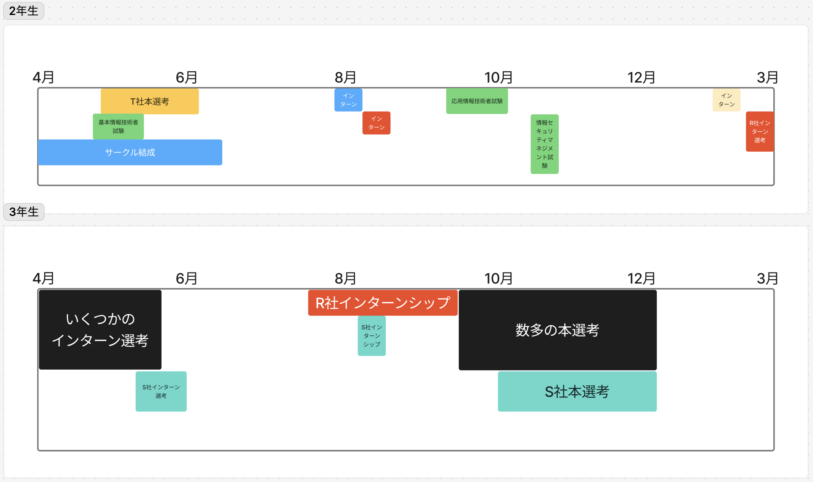
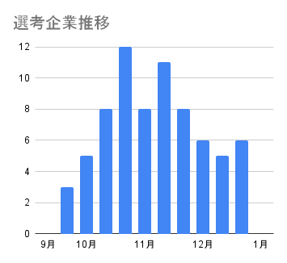

# 26卒学生エンジニア就活体験
## ~ Web業界編 ~

**ITCA 2025-05-04**
いとじゅん / @itojum1230

---

# 自己紹介

## いとじゅん
- 地方大学 情報系4年生
- GraphQL勉強中

---

# 伝えておきたいこと
- あくまで１就活生の体験談なので、真に受けないこと
- 発表では角が立ちそうな表現は抑えめにしてます
- 技術で殴るスタイルの就活はしなかったです
- このLTにおけるWeb業界は、大体自社サービスのWeb系

---

# 目次

1. 持っていた手札
2. Web業界への志望理由
3. 使ったサービス
4. 就活スケジュール
5. 就職活動
6. まとめ

---

# 持っていた手札

---

## 開発物編

- ハッカソンの開発物*2
    - リアルハッカソン
    - VRCハッカソン
- 大学祭で運用したWebアプリ
- アルバイト先に提供したシステム
- Ruby合宿で作ったゲーム

---

## ガクチカ編
- 技術系サークルの設立運営
    - 地域の公民館でセミナーの開催など
- アルバイト
    - エンジニア
    - プログラミング教室の講師

---

## 資格検定編
- IPAのLv3以下(AP以下)全部
    - ITパスポート
    - 基本情報技術者
    - 情報セキュリティマネジメント
    -  応用情報技術者
- Webデザイナー検定 エキスパート

---

# Web業界への志望理由　
1. 元々JavaScriptをやっていた
    - JavaとJavaScriptを間違えた
2. 技術系イベントが好き
    - Web系は特に技術系イベントが多い
3. 待遇が良い
    - お金！！！リモート！！！

---

# 使ったサービス

---

## メインで使ったサービス

## サブで使ったサービス

---

# 就活スケジュール

---

---

# 就職活動

##  ~インターンシップ編~

---

## 2年生のインターンシップ
- 地元企業を3社ほど
- 3年生に向けた練習
- 大学からの紹介や自治体の制度を使った
    - 選考なし
    - 宿泊費 & 交通費支給
        - ついでに帰省してた

---

## インターン選考(3年生)
- エントリー7社 → 参加4社
- 印象的だった選考(プラス方向で)
    - **R社**(大企業): 面談後選考スキップ
    - **S社**(SaaS系): 他社の長期インターン中でも中抜けできると思うからおいで！と言われた

---

## インターン参加(R社)
- 1.5ヶ月の長期インターン
- 東京で宿泊と交通費を支給
- オフィスのカフェテリア利用可
- アプリの新規機能開発(Android, Java)
    - リリースまではいかないワークショップ的な
- なんかソロだった

---

## インターン参加(S社)
- 4daysの短期インターン
- 宿泊支給(交通費はそもそも東京にいたのでなし)
- ハッカソン形式
    - アジャイル開発体験
- 優勝した
    - 景品でケーキ出てきた

---

## インターンでの学び
- 大企業、ベンチャー企業の雰囲気を知ることができた
    - 私は大企業の雰囲気や文化が合わなかった
    - 知名度に釣られて**軸から外れてしまっていた**
- 技術力の慢心が粉砕された
    - 他校の学生と接したのが初めてだった
    - 技術なんもわからん

---

# 就職活動
##  ~本選考編~

---

## 2年生の時に受けた選考
- T社(アート系?エンタメ系?)
    - 全学年対象のコーディングテストがあり、
    暇つぶしに受けたら通った
    - 最終面接で落ちた
    - 落ちた理由
        - 自己分析不足(というかしてない)

---

## 本選考スタート(3年生)
- 夏休みから本選考意識
- R社のインターンで夏休みが終わったので、持ち駒がない
- 第一志望はS社
    - 他社の選考で練習
    - S社を狙い撃ちするほどの自信はなかった

---

## 受けた企業
- エントリー数: 27社
- 内定: 4社
    - **S社**
- 辞退: 12社
- お見送り: 11社

---

## 印象的だった選考
- **S社**: 
    - 1次面接: 技術テストの内容を45分深掘りされて終了
    - 人事の方がとても親身だった
- **Sy社**:
    - 1~3次面接: ライブコーディングあり
---

## 内定承諾企業と選んだ理由
- **S社**
    - 社風や文化、事業が好き
    - カルチャーマッチしてると確信している
- 内定者インターンシップ中
    - 社風がマジで好き

---

# まとめ

---

## 就活を通して得た学び
- 自分の軸をできるだけ曲げないこと
    - あまり良い結果にはならないことの方が多い
    - しっかりとした軸があると、決断するときに楽
- 早期に業界を定めて就活するのが吉
    - 業界によって効果的な手札が異なる
    - 例: Web系は資格が効かない

---

## これから就活する人(いたら)へのアドバイス
- お祈りされても7:3で企業が悪いので気にしなくてok
    - 見送られる理由には色々な要因がある
    - 落ち込んでる暇があったら次の弾を装填するべき
- 気軽に辞退してok
    - 企業側も自分たち都合で落としてくるお互い様
    - ただ、IT業界はとても狭いことは覚えておくべき
---

# おわり

