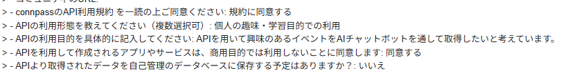

# Orvalでconnpass MCPサーバーを 自動生成してみた

**Setory 2025-06-28**
いとじゅん / @itojum1230

---

# 自己紹介

- いとじゅん(@itojum1230)
- 福プロ 元代表
- 趣味
  - VRChat
- 好きなテキストエディタ
  - Cursor

---

# OrvalとMCPサーバー

  

    
    
  

  - Orvalとは
    - OpenAPIからWebAPIのクライアントを 自動生成するライブラリ
  - MCPサーバーとは
    - AIエージェントと外部サービス(WebAPIなど)を繋ぐサーバー(雑)

---

# OrvalとMCPサーバー

  

    
    
  

  - Orvalとは
    - OpenAPIから<u>WebAPIのクライアント</u>を 自動生成するライブラリ
  - MCPサーバーとは
    - AIエージェントと<u>外部サービス(WebAPIなど)</u>を繋ぐサーバー(雑)

---

# できちゃうんです...

---

# OrvalでMCPサーバーが...!

---

# 開発の流れ

---

# API Keyを取得
- connpassのAPI Keyを利用申請して発行してもらいます
- 数回メールでやり取りしたら1営業日で発行してもらえました

---

# OpenAPI

  

    
  

  - connpass APIのドキュメントを 参考にOpenAPIを書きます
  - 普段よりパラメータのdescriptionを丁寧に書きます

---

# 生成してみる

  

    
  

  - orval.config.tsを書きます
  - `orval`コマンドを実行

---

# 403エラー

  

---

# ヘッダーがない...

  
  

---

# カスタムHTTPクライアントの追加

  

  
  

  - 認証情報を付加してみる
  - 再度生成してみる

  

---

# 動いた！

  

---

# おわり
- connpass MCPサーバーを作った
- Mastraと組み合わせていろいろ遊んでいきたい
- 想定用途
  1. 出張とかで東京に行く予定ができる
  2. 私のイベント参加傾向から、
  おすすめイベントを提案する
  3. イベント探しが楽になる

