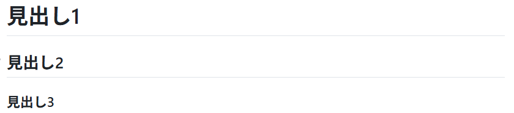
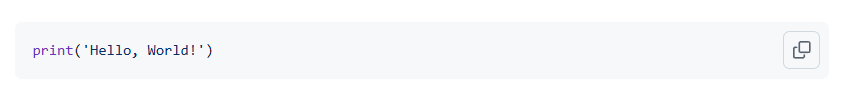
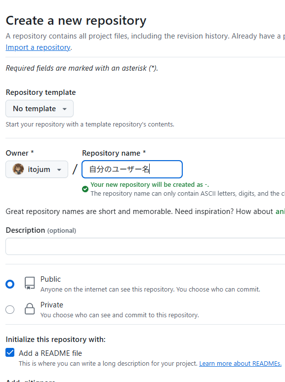
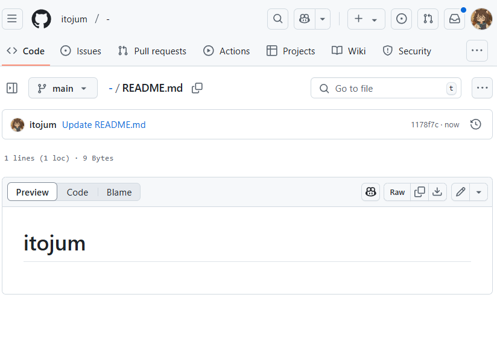
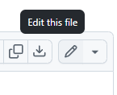
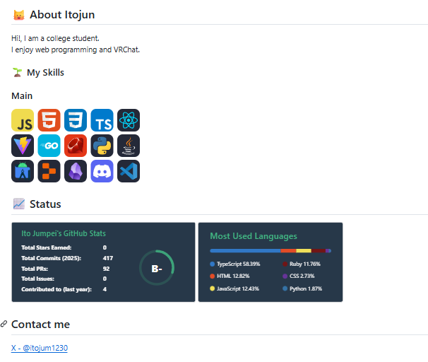

<script src="https://cdn.tailwindcss.com/3.0.16"></script>
<script>tailwind.config = { corePlugins: { preflight: false } }</script>


<div class="title">

# エンジニアの文書記法の大定番！
# Markdown記法
</div>
<div class="info">

**2025年06月11日**
伊藤 潤平
</div>

---

# 目次

<div class="contents">

1. Markdownとは？
2. Markdownはどこで使われてるの？
3. 実際にMarkdownでいろいろ書いてみよう
4. GitHubでProfileを書いてみよう

</div>

---

# Markdownとは？

- テキストベースの軽量マークアップ言語
  - マークダウンなのにマークアップ
- シンプルな構文で書ける
- テキストファイルとして保存可能

<div class="flex justify-end">
  
</div>

---

# Markdownはどこで使われてるの？

- 構造化された文書が欲しい
  - けど、Wordみたいなバイナリファイルは嫌
- そんなときにMarkdownが便利

### 使われているサービス
<div class="grid grid-cols-3 gap-4 w-1/2 mx-auto">
  
  
  
  
  
  
</div>

---

<div class="chapter">

# 実際にMarkdownで<br>いろいろ書いてみよう

</div>

---

<style>
</style>

# 見出し
`#`を文頭に付けて半角スペース、`#`の数で階層を表せます。

```markdown
# 見出し
## 見出し2
### 見出し3
```




---

# テキスト装飾

`**`で太字、`*`で斜体、`~~`で打ち消し線

```markdown
**太字**

*斜体*

~~打ち消し線~~
```


---

# リスト

`-`か`*`か`+`を文頭に入れて半角スペースでリスト
tabでネスト

```markdown
- リスト
  * リスト
    + リスト
```


---

# 番号付きリスト

`数字.`を文頭に入れて半角スペースで番号付きリスト

```markdown
1. リスト
2. リスト
3. リスト
```


---

# チェックボックス

`- [ ]`でチェックボックス
`- [x]`でチェック済みチェックボックス

```markdown
- [ ] タスク1
- [x] タスク2
```


---

# 引用

`>`を文頭に入れて半角スペースで引用
```markdown

> これは引用だぜえええええええええええええええええええ
> > ネストもできるぜ

```


---

# コード

`` ` ``か``~``で囲んでコードブロック
言語識別子を入れるとシンタックスハイライトが効く

````
```py
print('Hello, World!')
```
````



---

# テーブル

`|`で列を作成、`-`で区切り線を作成

```markdown
| ヘッダー1 | ヘッダー2 | ヘッダー3 |
|----------|-----------|----------|
| データ1   | データ2   | データ3   |
| データ4   | データ5   | データ6   |
| データ7   | データ8   | データ9   |
```


---

# リンク

`[リンクのテキスト](リンクのURL)`でリンク

```markdown
[Yahoo!](https://www.google.com/)
```


---

# 画像

``で画像
画像のURLを載せたら長すぎるので好きな画像リンクを貼ってね

```markdown

```


---

<div class="chapter">

# GitHubでProfileを書いてみよう

</div>

---

# 1. GitHubのリポジトリを作る

<div class="flex justify-center gap-4">
  

  <div class="w-1/2">

  **💡Point**
  - リポジトリ名は`自分のユーザー名`にする
  - Publicにする
  - Add a README fileを
    チェックする
  
  </div>
</div>

---

# 2. リポジトリを確認する & README.mdを編集する

<div class="flex justify-center gap-4">
  
  <div class="flex flex-col justify-center">
    
  </div>
</div>


---

# 3. 自由に編集してみよう

### こんなの書いたらいいんじゃないかな
- 職業(自分たちなら学生かな)
- 趣味
- 使っている技術
- リンク
  - SNS
  - ポートフォリオ

---

# 4. 確認してみよう

<div class="flex justify-center">
  
</div>

---

# まとめ

- Markdownはシンプルな構文で書ける
- 日常の中でメモを取るときなどに活用すると便利
- IT系はMarkdown使いがちなので使えたほうが良い
- 極論目次とリストだけでも十分使える

---

<div class="chapter">

# おわり

</div>