

# デプロイ講座
## ~Webアプリを公開してみよう！~

**福プロ 2025-07-23**
いとじゅん / @itojum1230

---

# 目次

1. はじめに
2. Webアプリケーションの仕組み
3. デプロイとは
4. Webアプリを動かしてみよう！
5. デプロイしてみよう！
6. まとめ

---

# はじめに

## 準備してもらったもの
- PC
- GitHubアカウント
- インストールしているもの
  - Node.js
  - Git

準備できてない方はこの後の時間で準備お願いします

---

# Webアプリケーションの仕組み

- めっちゃ簡略化するとこんな感じ

---

# Webアプリケーションの仕組み

- 今回の講座の内容だとこんな感じ

---

# デプロイとは

---

# Webアプリを動かしてみよう！

以下のリポジトリを**fork**して、**clone**してください
https://github.com/itojum/deploy_course

---

# Webアプリを動かしてみよう！

- READMEの実行方法に従って実行してみてください

  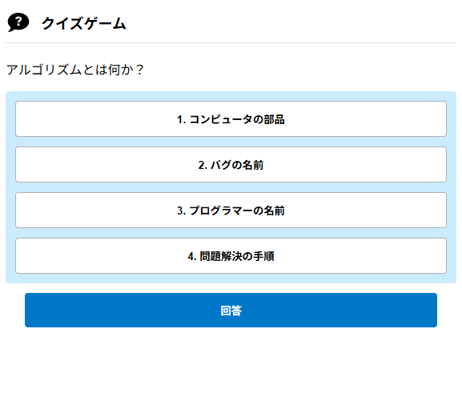
  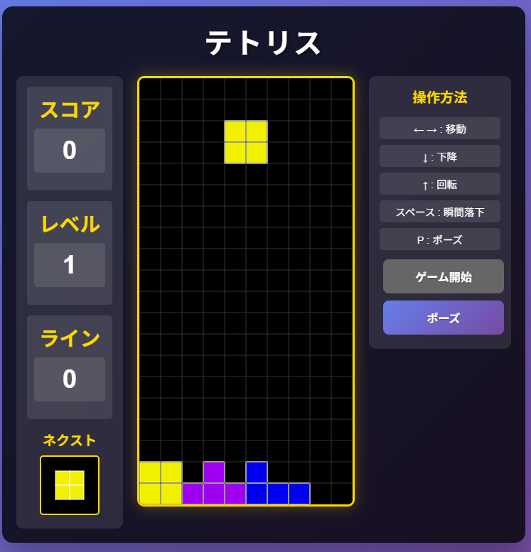
  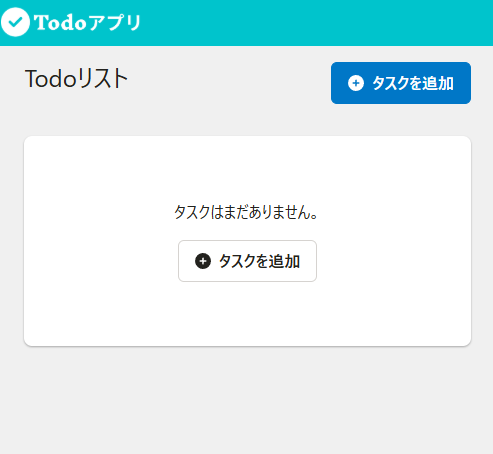

---

# デプロイしてみよう！

- 簡単にグローバルに公開するためには、
クラウドサービスを使うのがおすすめです
- Cloudflare Pages、GitHub Pages、Vercelを利用します
- 時間がある人はWebアプリのコードリーディングや
改造をしてみてください

---

# デプロイしてみよう！Cloudflare Pages編

## Cloudflare Pages
- Cloudflareのサービスの1つ
- 無料で結構いい感じに動く
- 凝ったアプリをデプロイするときは、Cloudflare Workersを使う

---

# デプロイしてみよう！Cloudflare Pages編

  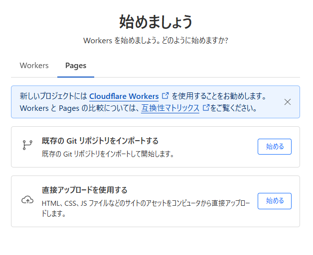
  
  1. Cloudflareのアカウントを作成
    - Googleログインがおすすめ
  2. 「アプリケーションを作成する」をクリック
  3. Pagesを選択
  4. 「既存のGitリポジトリをインポートする」

---

# デプロイしてみよう！Cloudflare Pages編

  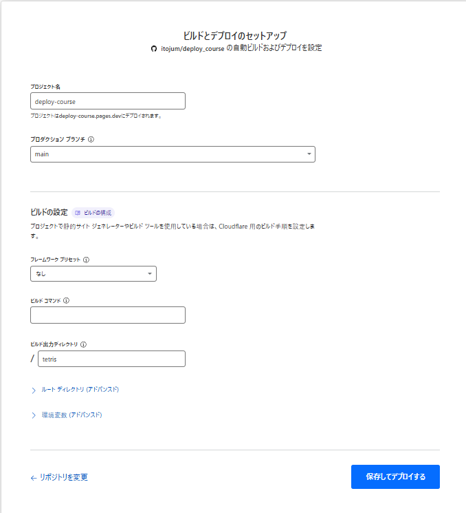

  5. `deploy_course`リポジトリを選択
  6. ビルド出力ディレクトリに`tetris`を入力
  7. 「保存してデプロイする」

---

# デプロイしてみよう！Cloudflare Pages編

  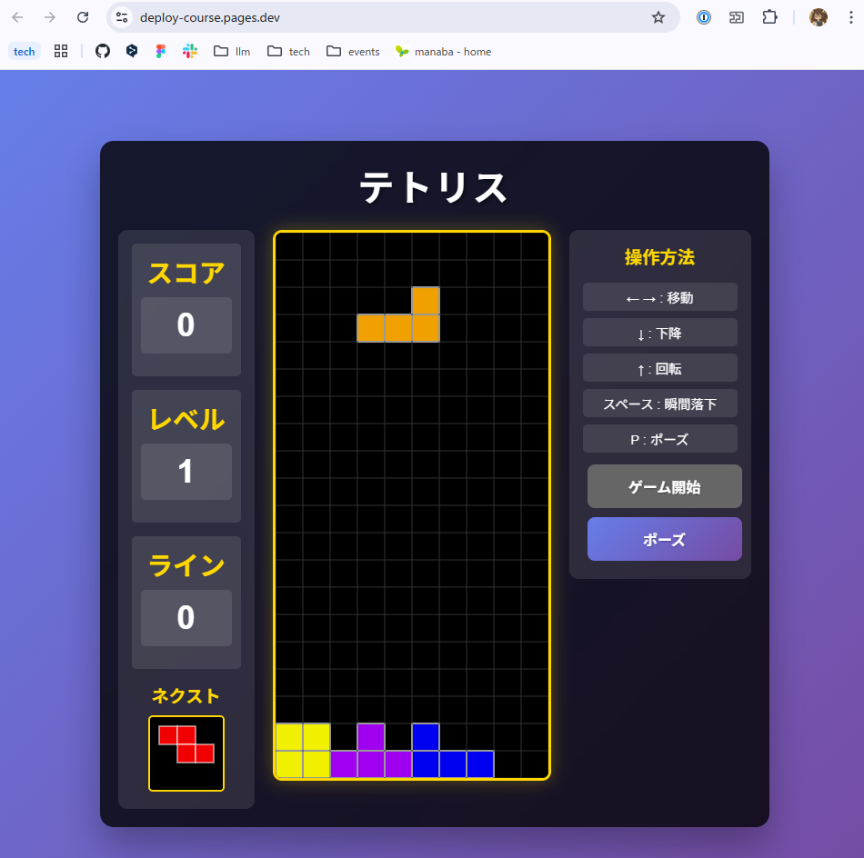

  8. デプロイが完了すると、URLが表示されます
  9. URLをクリックして表示されたら完了

---

# デプロイしてみよう！GitHub Pages編

## GitHub Pages
- GitHubのサービスの1つ
- 静的なWebアプリをデプロイするのには使える
- サーバーサイドは無理

---

# デプロイしてみよう！GitHub Pages編

  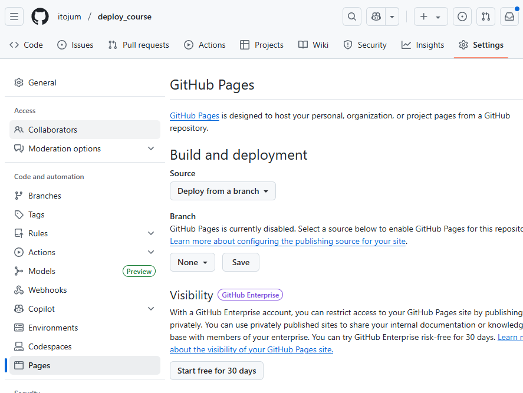

  1. forkしたリポジトリのSettingsを開く
  2. Pagesを開く
  3. Branchのmainを選択
  4. 「Save」をクリック

---

# デプロイしてみよう！GitHub Pages編

  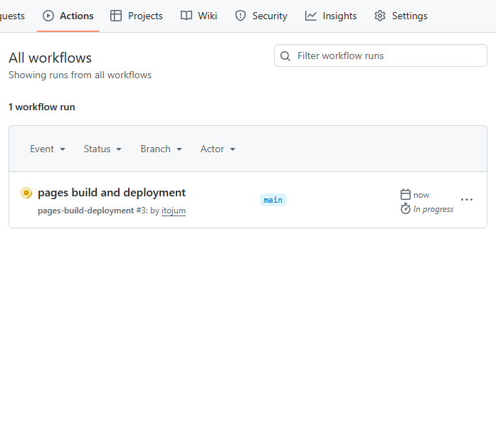

  5. Actionsタブを開く
  6. これが✅になったらクリック

---

# デプロイしてみよう！GitHub Pages編

`https://[ユーザー名].github.io/deploy_course/quiz/`

  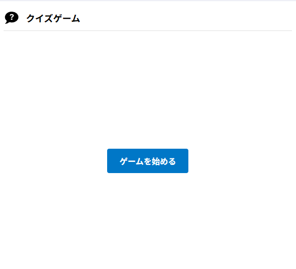

   7. 表示されたら完了

---

# デプロイしてみよう！Vercel編

## Vercel
- Web系のライブラリやフレームワークを大体デプロイできる
- Next.jsのデプロイをするならVercelが最適
- 今回はReactのアプリをデプロイしてみる

---

# デプロイしてみよう！Vercel編

  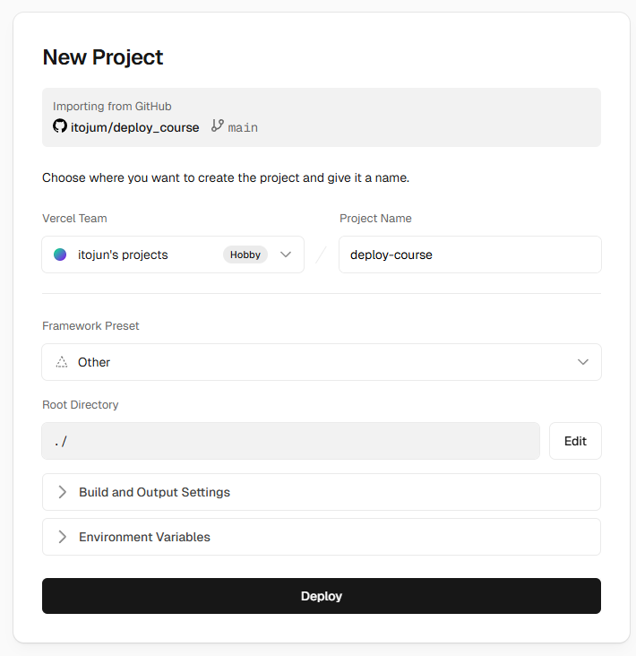

  1. Vercelのアカウントを作成
  2. 「Add New...」→「Project」をクリック
  3. `deploy_course`リポジトリをimport
  4. Root DirectoryのEditをクリックして`todo`を選択
  5. 「Deploy」をクリック

---

# デプロイしてみよう！Vercel編

  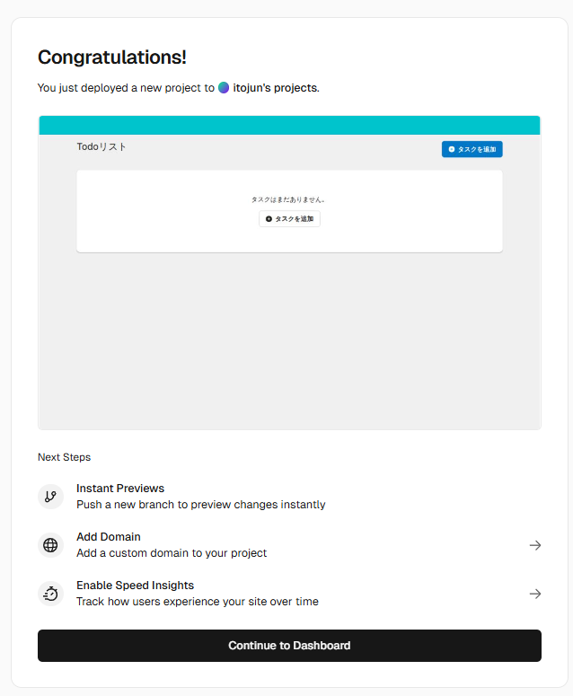

  6. アプリの画面をクリック
  7. 表示されたら完了

---

# まとめ

- Webアプリケーションの仕組み
  - ユーザー、ブラウザ、サーバー
- デプロイは割と簡単にできる
  - 今回はGitHub Pages、Cloudflare Pages、
  Vercelを利用した
  - どれが簡単だったかな?
- 自分が作ったアプリを公開してみよう！
