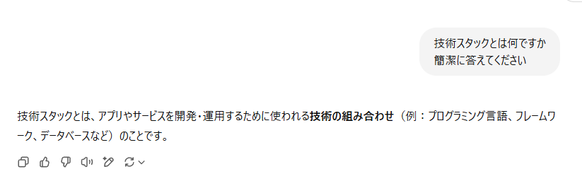

# 技術スタックってそもそも何があるの？

**福プロ 第一回講座 2025-05-21**
伊藤潤平 / @itojum1230

---

# エンジニアリングやってますか？！

---

# 目次

1. 用語解説
2. プログラミング言語たち
3. ライブラリ・フレームワークたち
4. 開発で使うサービスたち
5. まとめ

---

# 用語解説

---

## 1. 技術スタック

本講座では技術全般を指すときに使う言葉と考えてください

---

## 2. ライブラリ

- よく使われるコードや機能を再利用できる形にまとめたもの
- フレームワークと比べると規模は小さめ
  - 学習コストが小さい
- 例
  - TKinter(Python)
  - jQuery(JavaScript)

---

## 3. フレームワーク
- 開発効率を向上するために、最低限の骨組みを用意したもの
- ライブラリは開発する上の部品に過ぎないが、
フレームワークは全体の骨組み
- 例
  - Ruby on Rails(Ruby)
  - Next.js(JavaScript)

---

## 4. フロントエンド

- フロントエンドはユーザーが直接触る部分
- ユーザーが見る画面や操作画面のこと

## 5. バックエンド
- バックエンドはユーザーが直接触らない部分
- サーバー側の処理やデータベースの呼び出しのこと
---

# プログラミング言語たち

---

## Python
- 授業でも触れているお馴染みのプログラミング言語
- データ分析やAI開発によく使われる
- 簡潔な構文とライブラリが充実しているのが特徴

---

## JavaScript
- フロントエンド開発で使われる
- ウェブブラウザで動作する
プログラミング言語

## TypeScript
- JavaScriptのスーパーセット
- 静的型付けをサポート
- コードの安全性と可読性を向上

---

## Java
- 授業でお馴染み
- バックエンド開発でよく使われる
- 既存の業務アプリで使われていることが多い

---

## Kotlin
- Androidアプリ開発や
バックエンド開発で使われる
- Javaの後継言語

## Swift
- iOSアプリ開発や
MacOSアプリ開発で使われる
- Objective-Cの後継言語

---

## Ruby
- バックエンド開発でよく使われる
- 様々な便利な機能が充実している言語
- 日本人が開発したプログラミング言語

---

## Go
- バックエンド開発でよく使われる
- 高速な実行速度とシンプルな構文が特徴
- バックエンドやってる学生使いがち(偏見)

---

## C言語
- 組み込みやOSなど低レイヤーな開発でよく使われる
- 教育機関で用いられるため、
初めて触るプログラミング言語がCの人が多い

---

## C++
- C言語の拡張版
- 高いパフォーマンスが要求される開発によく使われる
  - 組み込み開発、ゲーム開発、AI開発など

---

## C#
- C++の拡張と思いきやJavaのほうが近いらしい
- バックエンド開発やゲーム開発でよく使われる
- 業務システムで使われがち

---

---

# まとめ

- 結論1
- 結論2
- 今後の展望 