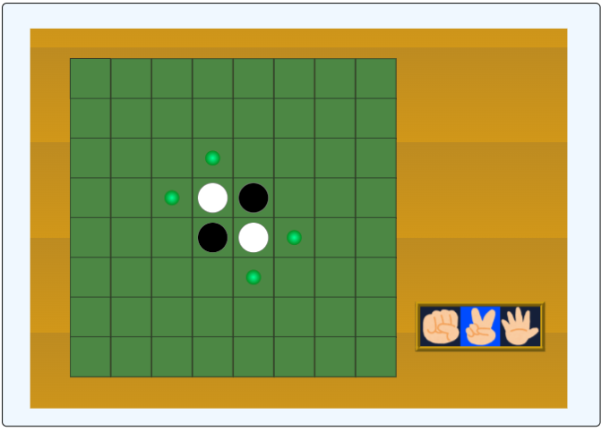
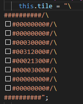
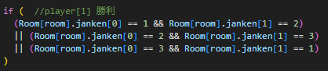
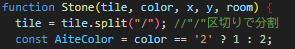
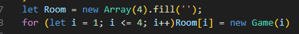
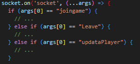

# 昔作ったオセロゲームの ソースコードを笑う会
## ~ Cursor vs 私 ~

 

**エンジニア集会LT会 2025-03-29**
いとじゅん / @itojum1230

---

# 目次
1. 自己紹介
2. このオセロゲームについて
3. ソースコードを笑う会
4. まとめ

---

# ⚠注意⚠

---

# 心臓に悪いコードが含まれます 視聴する際はご注意ください

---

# 自己紹介

  
  

  ## いとじゅん
  - 情報系大学生
  - インターンシップのためにRails勉強中
  - 最近Noshを買ってみた
    - ちょっとおいしい

  

---

# このオセロゲームについて

  

  - 3年くらい前に作った オンライン対戦オセロゲーム
  - アニメーションに ハマってた時期の産物
  - リアルタイム要素
    - ソケットで頑張った
  

  

---

# ソースコードを笑う会

---

# ルール

- Cursorくんにオセロゲームのコードを酷評してもらう
  - 頑張って昔の自分を擁護するのでどこまで対抗できるのか
- 以降の文字は基本的にCursorくんのコピペ

---

# 衝撃の盤面表現 - 闇の始まり

  
  

  - 文字列で盤面を表現するという狂気
  - バックスラッシュによる改行の連続
  - 配列を使わないという選択

---
# じゃんけんシステム - なぜ必要なのか

- オセロにじゃんけんが必要な理由
- 複雑すぎる条件分岐
- コイン投げではダメだったのか

---

# 石を置く処理 - 闇の深淵

- 文字列操作による石の配置
- 型の不一致（文字列と数値の混在）
- 謎の命名規則（AiteColor）

---

# ルーム管理 - 混沌の管理システム

- 配列のインデックスが1から始まる
- グローバル変数の乱用
- 4部屋固定という柔軟性の欠如

---

# ソケット通信 - 闇の通信術

  

  

  - すべてのイベントを 'socket'で処理
  - 引数の配列による謎の状態管理
  - 条件分岐の連続

  

---

# まとめ

- Winner: Cursor
- Cursorくんの指摘が理解できる程度に 成長したということで
- 可読性って大事だね

---

# おわり

