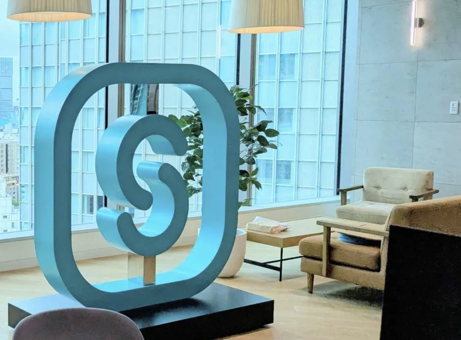
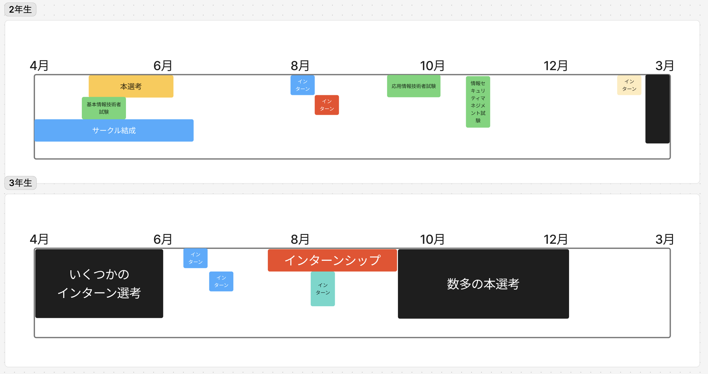
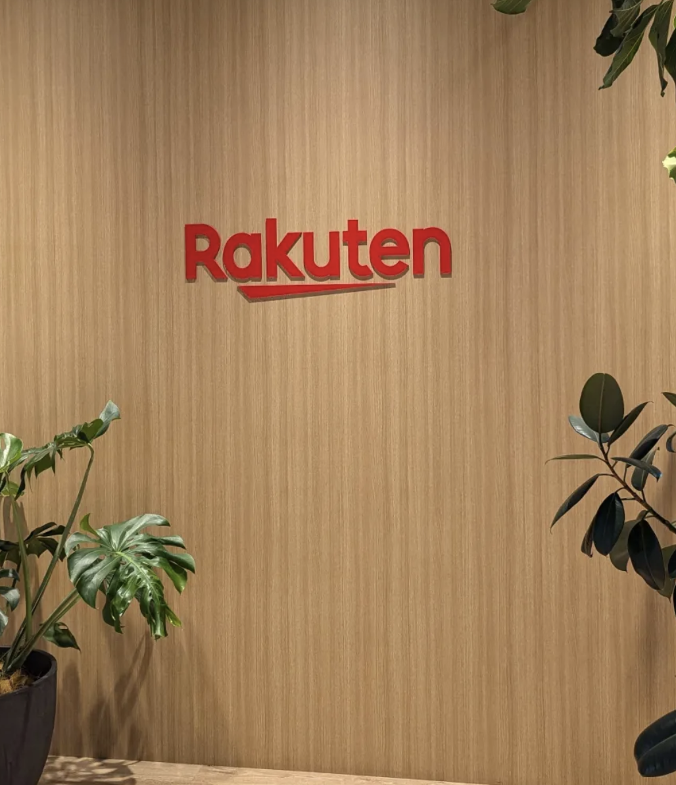
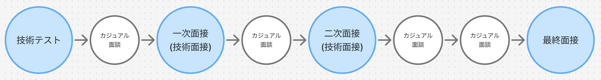

# 就活体験発表会
## ~ 企業選びのヒント ~

**就活体験発表会 2025-05-19**
情報工学科4年生 伊藤潤平

---

# 目次

1. 自己紹介
2. 内定先企業
3. 就職活動について
4. 企業選びのヒント
5. まとめ

---

# 自己紹介

## 伊藤潤平
- 情報工学科4年
- プログラミングサークル
- 趣味
  - VRChat, 技術系イベント

---

# 内定先企業

## 株式会社SmartHR

人事労務サービスを提供するSaaS企業
- 従業員数: たぶん1400名前後
- 本社所在地: 東京都

内定をいただいた職種
- プロダクトエンジニア

---

# 就職活動について

---

## 就職活動のスケジュール

---

  

  ## インターン選考
  - エントリー数: 7社
  - 参加: 4社
  - お見送り: 3社

  

  

  ## 本選考
  - エントリー数: 27社
  - 内定: 4社
  - 辞退: 12社
  - お見送り: 11社

  

---

## インターンシップ

楽天グループ株式会社
- 銀行事業部
- モバイルエンジニア
- インターン内容
  - 楽天銀行アプリの新規機能開発

---

## 本選考
株式会社SmartHR
- インターンシップ参加 → 書類選考スキップ
- 選考の期間: 3ヶ月

---

## 就職活動を通して
- 悪かった点
  - 自分の軸に背くとあまり良い結果にならない
  - 業界研究をもっと早くするべき
    - 志望する業界によってすべき行動は異なる
- 良かった点
  - 早め早めの行動ができたこと
---

# 企業選びのヒント

---

## 期待値調整
- 仕事ベース
- 一旦エンジニア前提
- 就職できれば何でもいいという人はスコープ外
- あくまで企業の絞り方なので調べ方は扱わない

---

## 職種で絞る
- 一言でエンジニアと言っても職種によってやることが全然違う
- 「エンジニアになりたいです！」だけだと難しい

例(ほんの一部)

- モバイルエンジニア
- MLエンジニア
- 組み込みエンジニア

- フロントエンドエンジニア
- バックエンドエンジニア
- インフラエンジニア

---

## 業界で絞る
- 業種業界によって業務や企業の雰囲気、カルチャーが全然違う
- 就職活動の進み方も違う
  - Web系だと27卒の本選考が始まってる企業もある

例

- ハードウェア
- 通信インフラ

- インターネット・Web
- 情報処理サービス

- ソフトウェア

---

## 規模で絞る
- 規模によって裁量や雰囲気、キャリアパスなどが異なる
- 企業規模(明確な定義なし)
  - ベンチャー
  - メガベンチャー
  - 中小企業
  - 大企業

---

## 待遇で絞る
- 給与
- 労働時間
- 福利厚生
- 年間休日、有給休暇
- リモートワーク

---

## 技術で絞る

- 企業の開発体験や
開発組織のスタイルが変わる
- エンジニアの雰囲気も全然違う
  - 右はRubyKaigiのafter

---

## キャリアで絞る

- この企業は将来設計に
マッチするのか
- 数年後どういう立場、
職種になっていたいのか

---

## 他にも大事なこと

カルチャーマッチ, 職場の雰囲気, 社員の雰囲気

インターンシップ、面接

社員の方と接点を持つ

---

# まとめ
- インターンシップ頑張って
  - 選考はもう始まっている
  - 複数参加して本選考を有利に進めよう!
- 自分の中の軸を早めに決めよう
  - その軸に合わせて企業は絞れる
  - その軸は判断基準になる

---

# 宣伝
## 「技術スタックって何があるの？」
- プログラミングサークルで講座を開きます
- 技術領域やその領域の代表的な技術を紹介します
- 2025年5月21日㈬ 16:30~17:30
- プログラミング道場

---

# おわり

