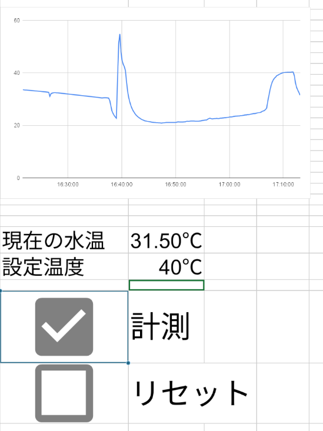
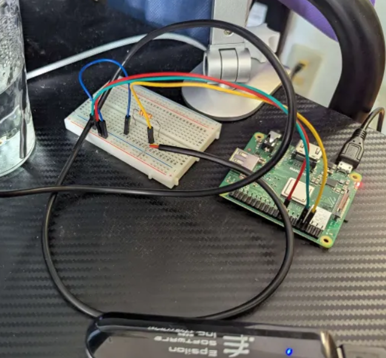
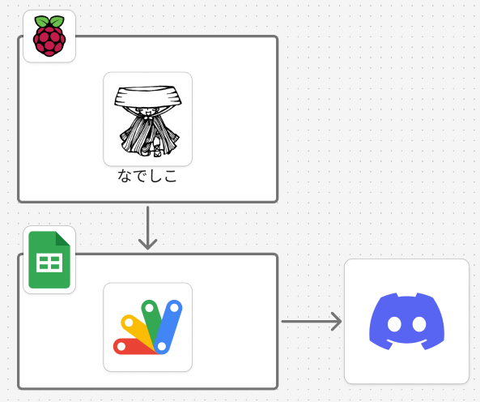
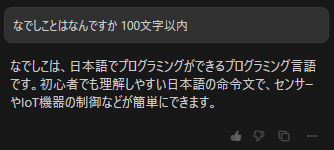
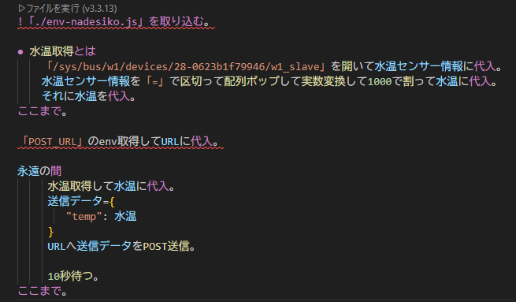
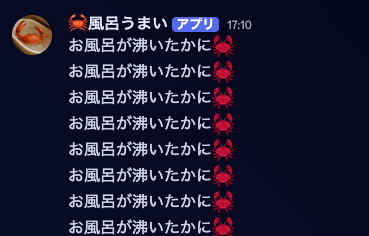

# Raspberry Piで快適な入浴を

**エンジニア集会 2025-04-26**
いとじゅん / @itojum1230

---

# 自己紹介

  
  

  ## いとじゅん
  - 情報系大学生
  - 内定者インターンで死んでる
  - RubyKaigi2025行ってきた
    - 鯛おいしかった

  

---

# レギュレーション順守

## **ハード**スキル + ソフト**ウェア**

みんなもLet's LT

---

# もくじ

  

  - 作ったもの
  - 素材集め
  - 技術構成と実装
  - 運用してみた感想

  

  

    
  

---

# 学生の一人暮らしでお風呂って面倒

---

# 作ったもの

  
  

  - お風呂の水位が一定になると
  Discordに通知
  - スプレッドシートで
  水温の推移を可視化

  

--- 

# 素材集め

  

  - 水温センサー：DS18B20
  - Raspberry Pi 3, その他部品
  - 段ボール
    - ケース用
  - モバイルバッテリー

  

  

    
  
  

---

# 技術構成と実装

  

  - なでしこで10秒ごとに
  温度を取得して送信
  - GASがスプレッドシートに温度を記録
  - GASでしきい値チェック
  - しきい値を超えたらDiscordに通知

  

  

    
  

---

## なでしこ

---

## なでしこ

---

## 水位問題

  #### Q. 水位を取得するには
  - 距離センサー
  - 水位センサー

---

## 水位問題

  

  #### Q. 水位を取得するには
  - 距離センサー?
  - 水位センサー?
  #### A. 水温センサーを垂らす
  

  

    
  

---

## グラフ & 通知

  

  

  

  

    
  

---

# 感想

  

  - ちょうどいい温度＆水位の風呂に
  久しぶりに入れた

- ケースは段ボール → 湿気&水滴に脆弱
  - 防水ケースいるかな

  

  

    
  

---

# おわり

